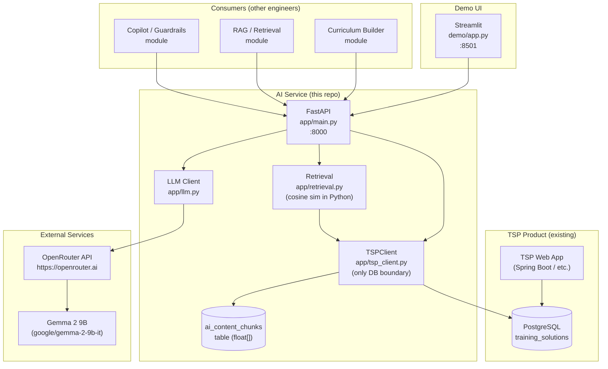

# Architecture — TSP AI Service

## Overview

The AI service is a separate Python process that sits **alongside** the existing TSP application. It never touches the TSP application code — it communicates only through the shared PostgreSQL database and external HTTP calls.



## Service Boundaries

| What TSP Owns | What the AI Service Owns |
|---|---|
| `trainings`, `modules`, `lessons`, `contents`, `assessments`, `users`, `trainees`, `objectives`, `outcomes` — all TSP core tables | `ai_content_chunks` — pre-computed embedding cache for RAG |
| Business logic for enrolling trainees, managing cohorts, approving content | Curriculum generation, LLM prompt construction, cosine similarity retrieval |
| User authentication & authorization | None — the AI service uses a single DB credential (see `limitations.md`) |
| Content review / approval workflow (`contents.status = ACCEPTED`) | Deciding which content is indexed (only ACCEPTED content enters the RAG index) |

**The `TSPClient` class is the only boundary point.** All other modules (`retrieval.py`, `main.py`) call through it. This keeps all raw SQL in one auditable place.

## Data Flow — Curriculum Generation

```
POST /curriculum/generate (training_id)
  → TSPClient.get_training_profile()     [SQL: trainings + objectives + outcomes]
  → TSPClient.get_modules_with_lessons() [SQL: modules + lessons + materials]
  → TSPClient.get_audience_profile()     [SQL: audience_profiles + base_data]
  → build_curriculum_prompt()            [string assembly]
  → call_gemma_json()                    [OpenRouter HTTP]
  → Curriculum.model_validate()          [Pydantic]
  → TSPClient.save_generated_curriculum()[SQL: INSERT ai_responses]
  ← Curriculum JSON
```

## Data Flow — Copilot Interaction

```
POST /copilot/message (training_id, question, learner_id?)
  → check_injection()                    [regex guardrail]
  → TSPClient.get_learner_profile()      [SQL: trainees + users]
  → retrieve_relevant_chunks()           [SQL: ai_content_chunks + Python cosine sim]
  → build_copilot_prompt()               [system + learner context + chunks + question]
  → call_gemma()                         [OpenRouter HTTP]
  ← CopilotResponse (answer + sources[])
```
