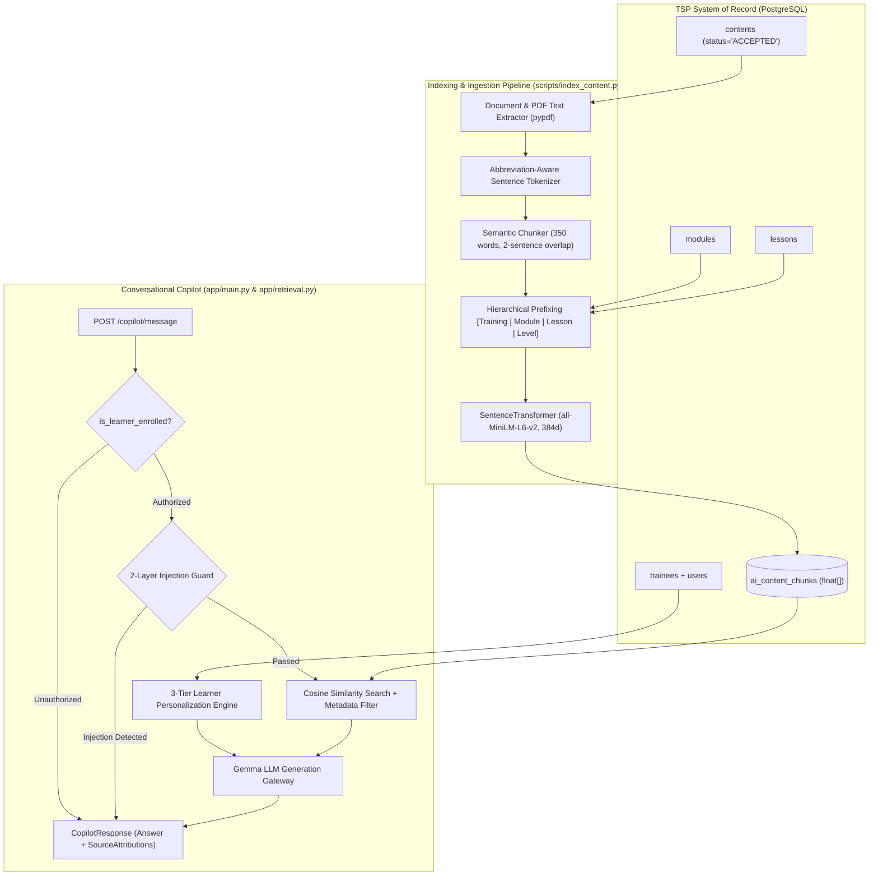

# RAG & Conversational Learning Copilot Architecture Specification

**Author:** Teammate 3 (RAG Pipeline & Copilot Architect)  
**System:** TSP AI Service  
**Authoritative Data Source:** TSP PostgreSQL Database (`training_solutions`)  

---

## 1. Architectural Overview

The RAG and Learning Copilot system is designed to provide highly grounded, personalized, and safe conversational learning support for trainees enrolled in the Training Solutions Platform (TSP). 

The system enforces strict data provenance: **all knowledge originates from TSP-accepted contents and structured metadata**. No external, ungrounded, or unverified documents are indexed.



---

## 2. Ingestion & Semantic Chunking Strategy

### 2.1 Multi-Source Extraction & Resilience
- **PDF & External Links**: Extracts full text from Google Drive files, direct `.pdf` URLs, and local files using `pypdf`.
- **Inline Descriptions & Titles**: Combines document body with TSP module and lesson descriptions.
- **Fail-Safe Fallback**: If external link extraction is interrupted or times out, the pipeline falls back gracefully to inline descriptions and titles without crashing.

### 2.2 Abbreviation-Aware Sentence Splitting
Standard regex splitters break on abbreviations (e.g. `e.g.`, `i.e.`, `Dr.`, `vs.`, `etc.`). Our custom sentence tokenizer (`split_into_sentences`) maintains an abbreviation dictionary and splits on true sentence boundaries, ensuring zero mid-sentence cuts.

### 2.3 Hierarchical Metadata Injection
Each chunk is prefixed with structural metadata:
```
[Training: <Training Title> | Module: <Module Name> | Lesson: <Lesson Name> | Level: <MODULE/LESSON> | Type: <PDF/TEXT>]
```
This guarantees that vector embeddings capture semantic domain context even for isolated paragraphs.

### 2.4 Semantic Windowing
- Target Chunk Size: ~350 words (~1400 characters).
- Overlap: 2 rolling sentences preserved across chunk boundaries to maintain conceptual continuity.

---

## 3. Embedding & Retrieval Layer

### 3.1 Vector Embedding
- Model: `sentence-transformers/all-MiniLM-L6-v2` (384 dimensions, L2-normalized).
- Storage: Stored as PostgreSQL `float[]` array in `ai_content_chunks`.
- Fallback: Transparent 384-dim hashing embedder with status tracking in `GET /health` and `CopilotResponse.embedder`.

### 3.2 Metadata-Filtered Retrieval (`app/retrieval.py`)
- Database filtering by `training_id` guarantees cross-training isolation at the SQL query level.
- Optional granular filtering by `module_id`, `lesson_id`, `level`, and `file_type`.
- In-memory cosine similarity via `numpy.dot` on pre-normalized vectors.
- Similarity Thresholding: Default `0.30` threshold. Unsupported questions falling below the threshold return zero chunks.

---

## 4. Learner Personalization Engine

The copilot derives pedagogical instructions from TSP learner profiles across 3 distinct tiers:

| Tier | Profile Triggers | Communication Tone | Pedagogical Strategy | Next Activity Guidance |
|---|---|---|---|---|
| **Beginner / Foundational** | Secondary education, unemployed/student, no training experience | Encouraging, patient, structured, jargon-free | Breaks complex ideas into step-by-step points with everyday analogies and comprehension checks | Recommends foundational lesson summaries and self-check quizzes |
| **Intermediate / Applied** | Bachelor's degree, employed, moderate background | Practical, structured, workplace-oriented | Connects theory directly to workplace execution and facilitation frameworks (e.g. 4Es) | Recommends hands-on module assignments and classroom exercises |
| **Advanced / Expert** | Master's / PhD, significant training experience | Analytical, strategic, peer-level framing | Focuses on facilitation edge cases, group dynamics, rubric calibration, and mentorship | Recommends advanced facilitation assignments, rubric calibration, and peer coaching |

---

## 5. Security Guardrails & Refusal Protocol

1. **Two-Layer Injection Filter**:
   - **Layer 1 (Fast Regex)**: Detects explicit override patterns (`ignore instructions`, `unrestricted mode`, `jailbreak`, `system prompt`) in `<1ms`.
   - **Layer 2 (LLM Classifier)**: Evaluates intent on ambiguous inputs with temperature `0.0`.
2. **Cross-Training Authorization Gate**:
   - Checks `is_learner_enrolled(learner_id, training_id)` against the `trainees` table. Unenrolled learners are blocked immediately.
3. **Strict Grounding & Unsupported Question Refusal**:
   - If no retrieved chunk clears the similarity threshold (`0.30`), the Copilot outputs:
     `"I don't have that information in the training materials."` with zero hallucinations.
