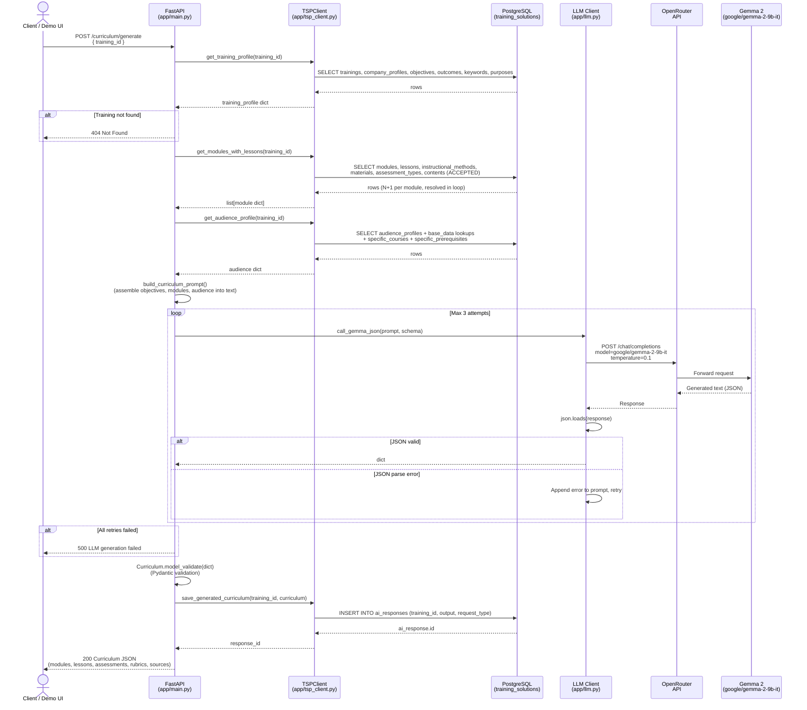

# Sequence Diagram — Curriculum Generation

## Notes

- The prompt includes real TSP data: training title, rationale, scope, objectives hierarchy, module/lesson structure, audience profile, and accepted content metadata.
- Validation failure triggers a retry with the specific Pydantic error appended to the prompt (max 3 attempts).
- The generated curriculum is saved to `ai_responses` (existing TSP table) rather than a new table, preserving write access simplicity.
- If save fails, the curriculum is still returned to the client — generation is not rolled back.
